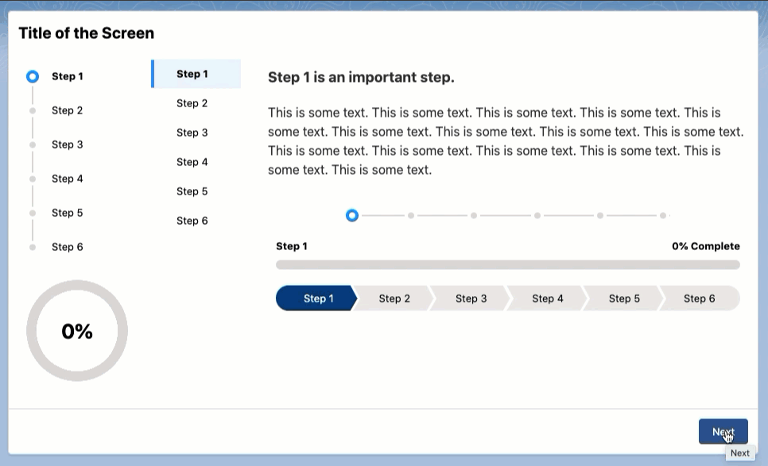
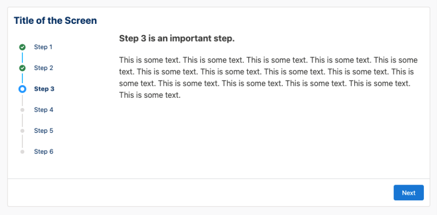
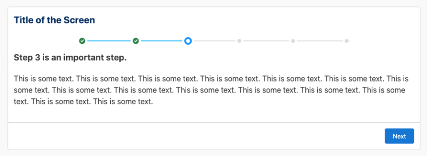
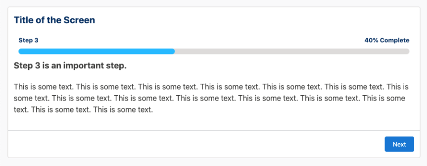
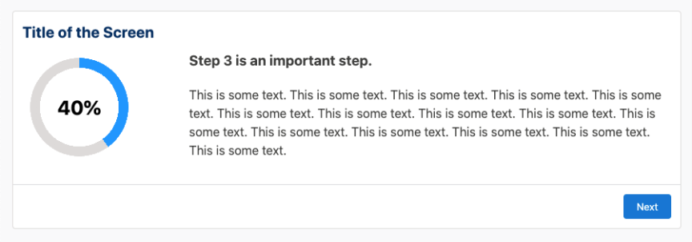
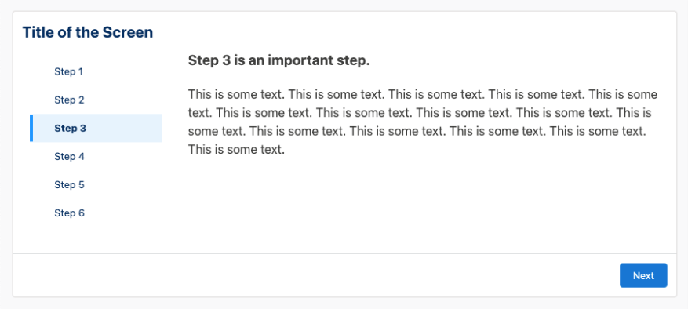

<h1 align="center">Dynamic Flow Progress Component</h1>

This package includes an Aura component that displays 6 different kinds of progress indicators on your Flow screens, to provide your users with easy-to-understand, guided screen flows.

<!-- Sections below are Optional -->

---

## Description

This component can be used on a Flow screen to indicate the steps in a flow and the progress made by the user:

* 6 different indicator types (see [below](https://github.com/SFDC-Assets/DynamicFlowProgress#indicator-types) for list and screenshots)
* Override completion % value with your own flow variable (Progress Bar and Progress Ring only)
* Additionally, it uses Custom Labels for display and assistive text, making it friendly for translation into other languages.

### Indicator Types

This single component can display one of six indicator types:

| Indicator Type | Screenshot |
| --- | --- |
| **“Vertical”**  To use, enter `Vertical` as your Indicator Type.  Based on the vertical variant of the [SLDS Progress Indicator component blueprint](https://www.lightningdesignsystem.com/components/progress-indicator/#Vertical). |  |
| **“Horizontal”**  To use, enter `Horizontal` as your Indicator Type.  Based on the base variant of the [SLDS Progress Indicator component blueprint](https://www.lightningdesignsystem.com/components/progress-indicator/#Base). |  |
| **“Bar”**  To use, enter `Bar` as your Indicator Type.  Based on the descriptive variant of the [SLDS Progress Bar component blueprint](https://www.lightningdesignsystem.com/components/progress-bar/#site-main-content).  The percentage is auto-calculated based on the current number of completed steps, but it can be overridden if you want to show a different number. See the Setup section above. |  |
| **“Ring”**  To use, enter `Ring` as your Indicator Type.  A generic progress ring that mimics SLDS styles.  The percentage is auto-calculated based on the current number of completed steps, but it can be overridden if you want to show a different number. See the Setup section above. |  |
| **“Path”**  To use, enter `Path` as your Indicator Type.  Based on the traditional [SLDS Path component blueprint](https://www.lightningdesignsystem.com/components/path/#site-main-content). |  |
| **“VertNav”**  To use, enter `VertNav` as your Indicator Type.  Based on the list variant of the [SLDS Vertical Navigation component blueprint](https://www.lightningdesignsystem.com/components/vertical-navigation/#site-main-content). |  |

## Install & Setup Instructions

**Please see the [Disclaimer](https://github.com/SFDC-Assets/DynamicFlowProgress#disclaimer)** (below)

1. Install from the AppExchange:  **[https://login.salesforce.com/packaging/installPackage.apexp?p0=04t6g000007zKAm](https://login.salesforce.com/packaging/installPackage.apexp?p0=04t6g000007zKAm)**
2. Add the Dynamic Flow Progress component to a screen element.
3. Configure the component’s properties (see below).
4. Rinse and repeat on other screens in your flow.
5. View the "Dynamic Flow Progress - Sample" flow for configuration examples.

### Component Properties

When you add this component to a Flow screen, there are a few properties to configure:

| Attribute     							| Description	|
| ----------------------------------------- | ------------- |
| **Comma-Separated List of Steps** 		| Add the full list of steps that will make up the indicator.  To save yourself from accurately configuring this list across multiple screens, create a text [constant](https://help.salesforce.com/s/articleView?id=sf.flow_ref_resources_constant.htm&type=5) with that comma-separated list of steps in it, and then reference that constant in this property. Now, when there are changes to your list of steps, you only have to update the value of your constant - not each and every instance of this component. |
| **Current Step**      					| Add the value of the current step. Make sure this value exactly matches the spelling of the step found in the comma-separated list.      |
| **Indicator Type**						| You can add one of the following values: `Vertical`, `Horizontal`, `Bar`, `Ring`, `Path`, or `VertNav`. These are explained below.      |
| **Current Step Percentage Completion**	| OPTIONAL.  The percentage shown in the Bar and Ring indicator types is auto-calculated based on the current number of completed steps, but it can be overridden if you want to show a different number.    **_To use the auto-calculated %_**: Do nothing - just leave the this property blank.    **_To override_**: In the component’s configuration, add a value to this property. The value needs to be an integer between 0 and 100 and it can be a static value or a variable that you’ve calculated. |

### Custom Labels Available for Translation

Text and assistive text that displays in the component uses Custom Labels so that you can translate it into languages other than English. I decided not to include the translations themselves because, well, I’d only butcher some very fine linguistic traditions:

* **DFP_Complete** – In the Bar indicator type, this is the text that follows the current % (e.g. 20% Complete). It is also used for assistive text to designate previously completed steps in the indicator.
* **DFP_Current** – used for assistive text only to designate the current step in the indicator.
* **DFP_Upcoming** – used for assistive text only to designate an upcoming step in the indicator.

Once you have enabled Translation Workbench and added supported languages in your org, you can create translations that will override the default English values (from Setup, visit Custom Labels; see [this help article](https://help.salesforce.com/s/articleView?id=sf.cl_translate_edit.htm&type=5)).

### FAQ

**_Q: Is there an easier way to create a reusable list of steps to use in the Comma-Separated List of Steps property? It’s tedious to have to enter the list on every screen where I’m using the component._**

A: Yes! Create a [Constant](https://help.salesforce.com/s/articleView?id=sf.flow_ref_resources_constant.htm&type=5) resource (Type = Text) that contains your comma-separated list of steps. Then, just reference that constant in this property every time you use the component. Now, when there are changes to your list, you only have to manage the value of your constant and it takes effect across all instances of the component.

**_Q: Can I easily customize the colors/branding?_**

A: The current release of this component focuses on delivering a component that’s on-brand for the Salesforce Lightning Design System (SLDS).

**_Q: Can I easily customize translate text that's part of the component?_**

A: Yes! See the section (above) about the Custom Labels available for translation.

## Release History

1.2 Initial release (24 Nov 2021)

## Maintainers

[Mitch Lynch / egyptguy](https://github.com/egyptguy)

## Acknowledgements

Many thanks to [John Meyer / johnsfdemo](https://github.com/johnsfdemo) and the Salesforce Global Public Sector's Platform Blackbelts for their encouragement and feedback on this component!

## Disclaimer

THIS APPLICATION IS PROVIDED BY THE COPYRIGHT HOLDERS AND CONTRIBUTORS "AS IS" AND ANY EXPRESS OR IMPLIED WARRANTIES, INCLUDING, BUT NOT LIMITED TO, THE IMPLIED WARRANTIES OF MERCHANTABILITY AND FITNESS FOR A PARTICULAR PURPOSE ARE DISCLAIMED. IN NO EVENT SHALL THE COPYRIGHT OWNER OR CONTRIBUTORS BE LIABLE FOR ANY DIRECT, INDIRECT, INCIDENTAL, SPECIAL, EXEMPLARY, CONSEQUENTIAL OR SIMILAR DAMAGES (INCLUDING, BUT NOT LIMITED TO, PROCUREMENT OF SUBSTITUTE GOODS OR SERVICES; LOSS OF USE, DATA, OR PROFITS; OR BUSINESS INTERRUPTION) HOWEVER CAUSED AND ON ANY THEORY OF LIABILITY, WHETHER IN CONTRACT, STRICT LIABILITY, OR TORT (INCLUDING NEGLIGENCE OR OTHERWISE) ARISING IN ANY WAY OUT OF THE USE OF THIS APPLICATION, EVEN IF ADVISED OF THE POSSIBILITY OF SUCH DAMAGE.

SUBJECT TO THE FOREGOING, THIS APPLICATION MAY BE FREELY REPRODUCED, DISTRIBUTED, TRANSMITTED, USED, MODIFIED, BUILT UPON, OR OTHERWISE EXPLOITED BY OR ON BEHALF OF SALESFORCE.COM OR ITS AFFILIATES, ANY CUSTOMER OR PARTNER OF SALESFORCE.COM OR ITS AFFILIATES, OR ANY DEVELOPER OF APPLICATIONS THAT INTERFACE WITH THE SALESFORCE.COM APPLICATION, FOR ANY PURPOSE, COMMERCIAL OR NON-COMMERCIAL, RELATED TO USE OF THE SALESFORCE.COM APPLICATION, AND IN ANY WAY, INCLUDING BY METHODS THAT HAVE NOT YET BEEN INVENTED OR CONCEIVED.
